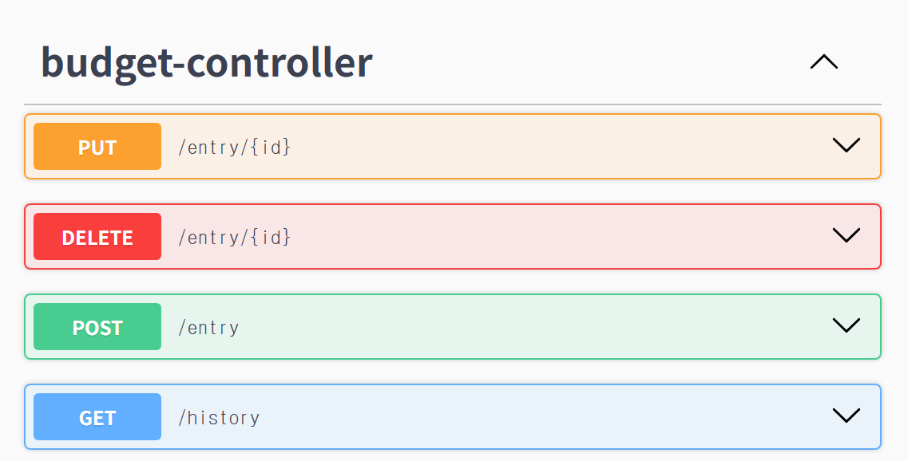

# Budget Tracker API

A simple REST API built with Spring Boot for tracking income and expenses.  
Started from a [console-based Java app](https://github.com/git-skc74/budget-tracker) to a full backend API.

## Endpoints
| Method | URL                                             | Description                                 |
|--------|-------------------------------------------------|---------------------------------------------|
| POST   | /entry?amount={amount}&category={category}      | Add income (positive) or expense (negative) |
| GET    | /history                                        | Get all transactions and total              |
| PUT    | /entry/{id}?amount={amount}&category={category} | Update entry                                |
| DELETE | /entry/{id}                                     | Delete entry                                |

*Tested via Swagger UI*


## Run Locally
1. Set up MySQL and create a database named `budget`
2. Update `application.properties` with your MySQL credentials (change other settings if needed)
3. Run the application
```bash
./gradlew bootRun
```

## Tech Stack
- Java 21
- Spring Boot
- Spring Data JPA
- MySQL
- Gradle
- Swagger UI